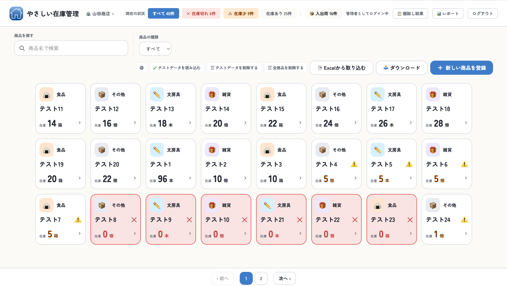
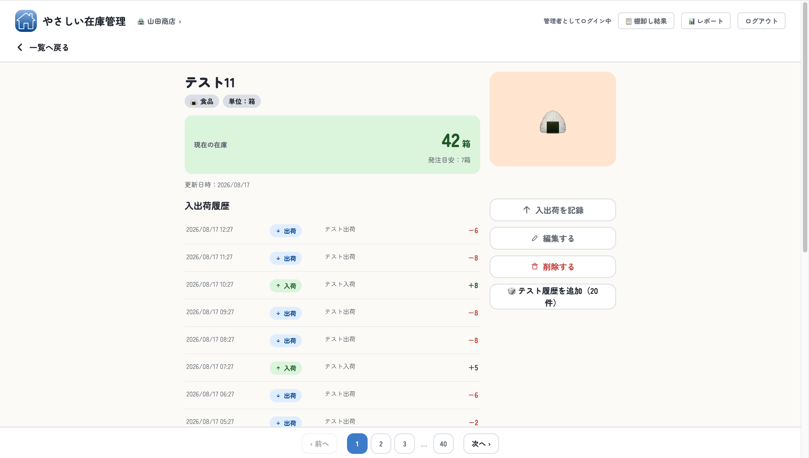
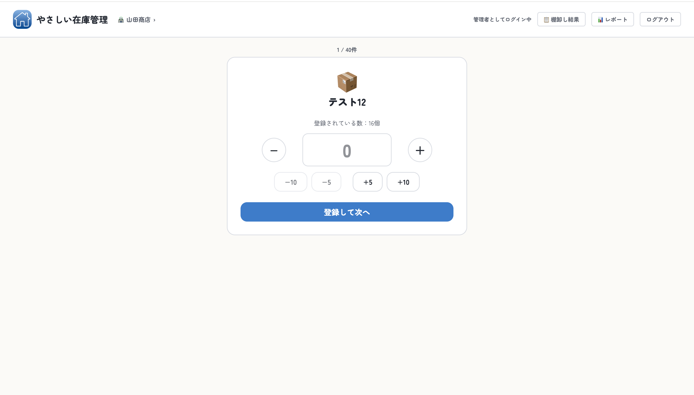
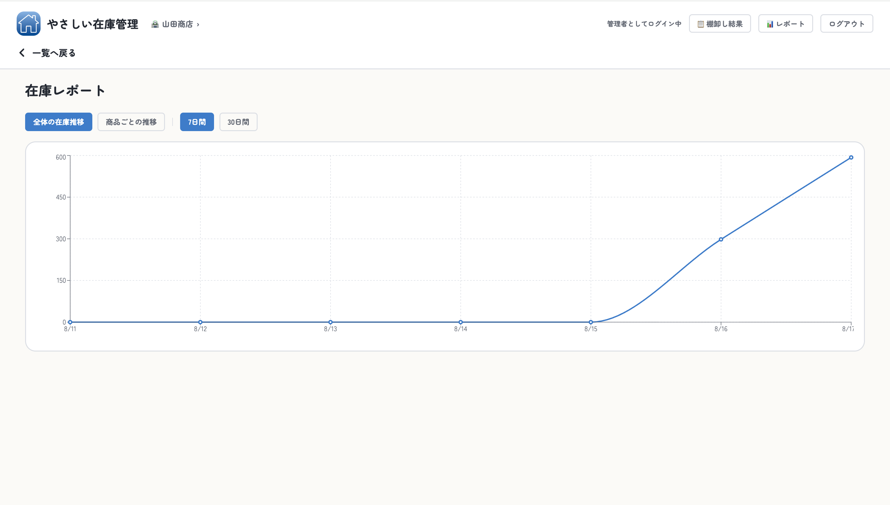

# 🏪 やさしい在庫管理

PC操作が苦手な個人事業主・小規模店舗向けの、シンプルで分かりやすい在庫管理システムです。

職業訓練校の学習成果物として制作しました。

## 📸 スクリーンショット

### 商品一覧画面



### 商品詳細画面



### 棚卸し画面



### 在庫推移レポート画面



## ✨ 主な機能

- 商品一覧・検索・カテゴリ絞り込み
- 在庫状況の可視化（在庫少・在庫切れの色分け表示）
- 商品登録・編集・削除
- 入出庫記録・履歴管理
- Excel/CSVでのインポート・エクスポート（ダウンロード機能）
- 在庫推移グラフ（レポート機能、7日間／30日間切替）
- 棚卸し機能・棚卸し結果一覧
- 管理者・スタッフの権限管理（ログイン機能）

## 🛠️ 技術スタック

- React / Vite
- Supabase（データベース・認証）
- Tailwind CSS
- Recharts（グラフ表示）
- SheetJS / xlsx（Excel入出力）
- react-router-dom

## 🚀 セットアップ方法

```bash
npm install
```

`.env.example`をコピーして`.env`ファイルを作成し、`VITE_SUPABASE_URL`・`VITE_SUPABASE_ANON_KEY`にお使いのSupabaseプロジェクトの実際の値を設定してください。

```bash
cp .env.example .env
```

```bash
npm run dev
```

## 🔭 今後の展望

- 就労継続支援B型事業所向けの3層権限管理（管理者・スタッフ・利用者）
- Dify（AI）との連携による在庫管理・発注支援機能の追加
